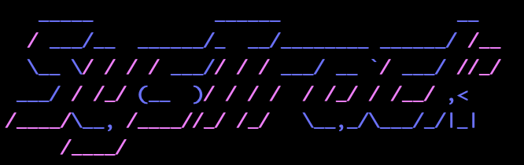
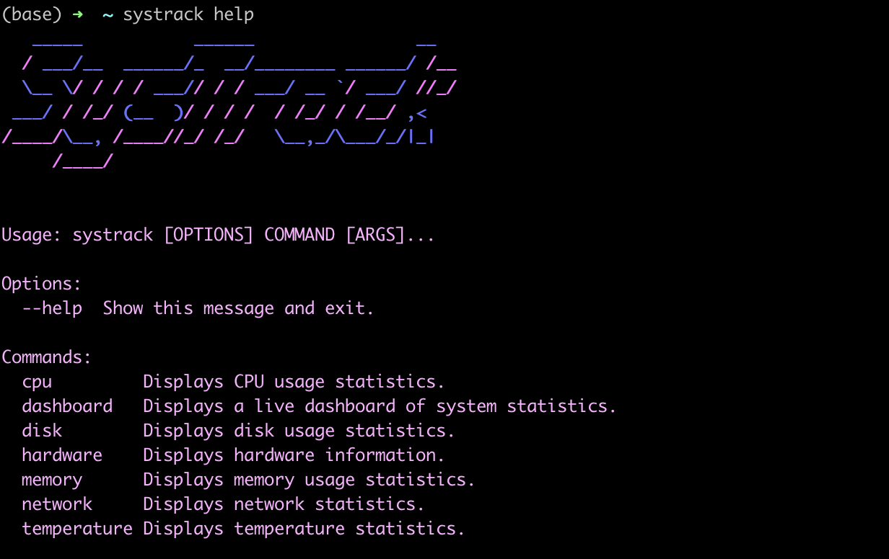
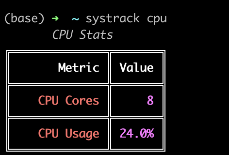
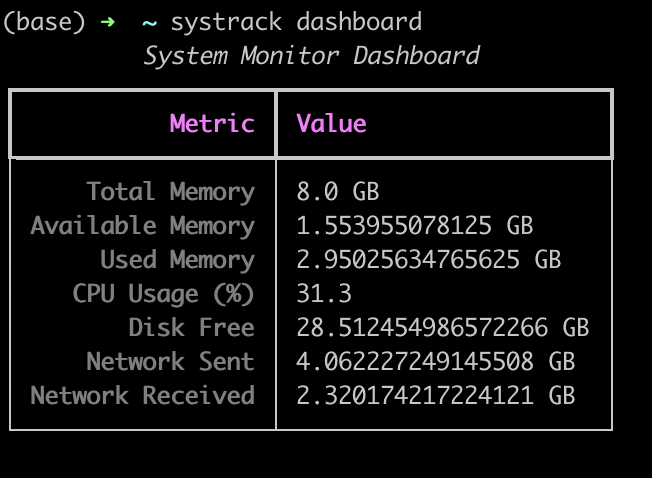
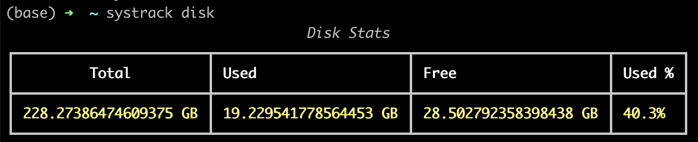

<p align="center">
  
</p>

<h1 align="center">SysTrack</h1>

<p align='center'>SysTrack is a powerful CLI tool for monitoring and tracking system resources in real-time.</p>

## Features

- Memory usage statistics
- CPU usage tracking
- Disk usage information
- Network statistics
- Hardware information
- Temperature sensors (Linux and FreeBSD)
- Live system dashboard

## Installation

```bash
pip install systracker
```

# SysTrack CLI Commands

This section provides an overview of all available commands in the SysTrack CLI tool.

## systrack help



The `systrack help` command provides an overview of all available commands in the SysTrack CLI tool. It displays a stylized ASCII art logo of "SysTrack" followed by usage instructions, available options, and a list of all commands with brief descriptions. This command is essential for users to quickly understand the tool's capabilities and how to use each feature. The help output includes information on CPU, dashboard, disk, hardware, memory, network, and temperature commands, giving users a comprehensive guide to monitoring various aspects of their system.

## systrack cpu



The `systrack cpu` command provides a quick and visually appealing snapshot of the system's CPU statistics. It displays information in a neatly formatted table with two key metrics:

1. **CPU Cores**: Shows the total number of CPU cores available on the system. In this example, the system has 8 cores.

2. **CPU Usage**: Displays the current CPU utilization as a percentage. The screenshot shows a 24.0% usage, indicating the current load on the CPU.

This command is particularly useful for quickly assessing the CPU's capacity and its current workload. The clear, color-coded output makes it easy to read and interpret at a glance, making it an excellent tool for system administrators and users who need to monitor CPU performance regularly.

## systrack dashboard



[Add functionality description for the dashboard command here]

## systrack disk



[Add functionality description for the disk command here]

## systrack hardware


[Add functionality description for the hardware command here]

## systrack memory


[Add functionality description for the memory command here]

## systrack network


[Add functionality description for the network command here]

## systrack temperature


[Add functionality description for the temperature command here]